# Campaign 2026-09: six topologies, ten sizes, three loads

The last and cleanest measurement of the current code: 60 cells (6 topology
families × N = 10…100 nodes × 3 loads on the same mesh), one SLURM job per
cell on a 64-core node of CESGA's FT3, every link a simulated QKD link, every
security default of the fifth audit in force. This page carries everything a
reader needs: the raw per-cell data (197 MB) lives under `tests/results/`,
which is gitignored and not in the repository. Section 9 says how to run it
again.

Related: [architecture](../architecture.md) for what the modules are,
[engineering notes](../engineering-notes.md) for the design invariants the
numbers rest on, [tests/local-mesh](../../tests/local-mesh/README.md) for the
harness, [qkc/README.md](../../qkc/README.md) for the link layer where the
two findings of § 7 live, [sdn/README.md](../../sdn/README.md#rates) for the
allocator behind the fairness numbers, and the [docs index](../README.md).

## 0. Executive summary

- Every QKD link is modelled as R₀·10^(−αd/10) with R₀ = 2 000 keys/s,
  α = 0.2 dB/km and d = 5 km (1 588.7 keys/s per link), except in the RGG,
  where each edge runs at its own 2–47 km. All absolute rates below are
  proportional to that R₀; the ratios are not.
- Every cell ran clean: 0 corrupt keys, 0 onion failures, 0 crashes, 0 byte
  mismatches in the ETSI-014 rounds, from N = 10 to N = 100.
- Under closed-loop saturation the system extracts 82–100 % of what the
  fibre can produce in every uniform-distance topology and sustains more
  than the uniform-demand ceiling (×1.0–1.3 in the star, ×1.6–2.5 in ring
  and bridge, ×1.8–5.0 in the RGG), because the α-fair allocator lets short
  pairs use the material long pairs would burn on transit hops.
- The price is fairness: the Jain index runs from 1.00 (star) down to 0.07
  (RGG), and in the RGG the worst pair is served about 1 % of a uniform
  share.
- The paced load at half the ceiling is absorbed at 93–101 % with p99 of
  1–8 ms everywhere except the RGG, whose 700–900 keys/s edges throttle the
  pairs that cross them.
- The fill from empty follows the fibre (pairs × 4 096 keys over the
  aggregate slope), so only N ≤ 20–40 fill inside the 600 s window.
- The numbers found two things in the code: a replay-window race that
  rejected legitimate frames on the most loaded links (fixed on 2026-09-03,
  the three affected cells re-measured to zero) and the star's single hub
  QKC as its structural limit: intake drops from N = 30, expired keys from
  N = 40, sustained rate below the fibre ceiling from N = 70, collapse from
  N = 80–90 (§7.2).

## 1. What was measured

### Families and sizes

Generated by [`tests/local-mesh/topologies.py`](../../tests/local-mesh/topologies.py)
(node ids 1…N, seed 42), N = 10, 20, …, 100, so N(N−1) = 90 … 9 900 ordered
pairs per cell.

| Family | Construction | Edges at N = 100 | Mean hops (N = 10 → 100) |
|---|---|---|---|
| star | hub = node 1, N−1 leaves | 99 | 1.80 → 1.98 |
| ring (C_N) | pure cycle, edge-transitive at every N | 100 | 2.78 → 25.25 |
| bridge | two cycles of N/2 joined by the single edge (1, N/2+1) | 101 | 2.56 → 19.44 |
| mesh (grid) | r×c four-neighbour grid, as square as N allows (10 = 2×5 … 100 = 10×10) | 180 | 2.33 → 6.67 |
| RGG | N uniform points on a square of side 30·√(πN/4) km, edge if d ≤ 30 km, components joined by their shortest cross pair; each edge keeps its Euclidean distance | 177 | 3.13 → 12.18 |
| random | random spanning tree plus extra edges up to max(N−1, 3N/2), kept connected | 150 | 1.89 → 4.26 |

### The QKD link model

Every edge is one `quditto` process (the simulated KME) shared by the two
QKCs of the link, so there is no per-direction rate
([quditto/README.md](../../quditto/README.md#what-it-is-for-and-what-it-is-not)).
It mints 256-bit keys at R₀·10^(−αd/10) in batches of R/10 per 100 ms tick
([`quditto/src/service.rs`](../../quditto/src/service.rs)), with a buffer of
8 192 keys (`--max-buffer`, default) and `full_mode = drop`. The SDN sizes
the edge with the same formula
([`sdn/src/topology.rs`](../../sdn/src/topology.rs),
`quditto_capacity_keys_per_second`) and replaces it with the rate the QKC
measures in situ when the two drift by ≥ 5 %; here they agreed to 0.93–1.04,
so the override stayed dormant (see
[QKD rate estimation](../engineering-notes.md#qkd-rate-estimation-in-situ-2026-09-01)).
Capacity is not R₀: read
[Theoretical rate — NOT R0](../engineering-notes.md#theoretical-rate--not-r0)
before comparing anything to "the theoretical".

The campaign fixed R₀ = 2 000 keys/s, α = 0.2 dB/km and d = 5 km
(`DKMS_MESH_R0`, `DKMS_MESH_ALPHA`, `DKMS_MESH_DIST_KM` in `mesh.sh`), so
star, ring, bridge, mesh and random run every link at 1 588.7 keys/s. The
RGG is the family that exercises distance: its edges span 2.2–46.7 km
(medians of 19–23 km per instance), which the formula turns into
233–1 811 keys/s (medians 692–861 keys/s).

| d (km) | keys/s | % of R₀ |
|---|---|---|
| 0 | 2 000 | 100 |
| 5 | 1 588.7 | 79.4 |
| 10 | 1 262 | 63.1 |
| 20 | 796 | 39.8 |
| 30 | 502 | 25.1 |
| 47 | 230 | 11.5 |

Three consequences for reading the results. Absolute rates scale linearly
with R₀ and fill times with 1/R₀; the dimensionless columns (sustained /
ceiling, utilisation, effective hops, Jain, worst pair, rejected fraction)
do not move. The exponential in α·d is what makes distance matter, and a
uniform 5 km world hides it: the RGG's slow edges, its unfairness and its
L1 throttling all come from that term. And the model is deliberately
simple: one shared rate per link, no time variation, no detector floor, no
finite-key correction, and one 256-bit key spent per hop per 32-byte block
on the one-time-pad path. Real hardware has another R₀ and a floor at long
distance, which is why the QKC measures the rate and announces it: in
production the SDN needs neither R₀, α nor d.

### The three loads, and the recovery after them

All four phases run on the same mesh, in sequence
([`campaign_cell.sh`](../../tests/local-mesh/campaign_cell.sh)):

| Phase | What runs | Ends |
|---|---|---|
| L0 | nothing: from empty buffers, the generator fills `buffer_enc` of every ordered pair through ORR, QKC and fibre | when every ordered pair holds 4 096 keys (+60 s of rest), or at 600 s |
| L1 | one paced flow per ordered pair, aggregate offered load = 50 % of min(Σcap/ħ, 30 000) keys/s | 300 s |
| L2 | one closed-loop flow per ordered pair, 100 ms pause after each 429/503 | 300 s |
| REC | nothing: the generator refills after L2 | when every pair is full again, or at 180 s |

An ETSI-014 integrity round (`mesh.sh keys`: `enc_keys` on the master's
DKMS, `dec_keys` of the same `key_ID` on the slave's, bytes compared) runs
after L1 and at the end, over 10 nodes (90 ordered pairs) per round. The
load client is [`tests/loadgen`](../../tests/loadgen/src/main.rs)
(`sae_load`: rustls, ML-DSA client certificates, one process per master DKMS
with N−1 threads, one 256-bit key per request).

### Metrics and ceilings

- **Sustained** (L2): (keys served − stock drained) / window, over the last
  2/3 of the phase, with the three stores sampled: DKMS `buffer_enc`, QKC
  ENC rings and every quditto's `stored_key_count`. Without the correction
  the "sustained" figure would include the 4 096 × pairs keys stored during
  L0.
- **Fibre utilisation** = Σtaken / Σcap over the QKC keystores; **effective
  hops** = Σtaken / Σemitted (QKD keys spent per transport key delivered).
- **Jain index** over keys served per ordered pair; **worst pair /
  uniform** = min_k x_k / (served / pairs).
- **Ceiling** Σcap/ħ: the aggregate rate if every ordered pair received the
  same share and every key crossed the mean number of hops. The
  **bottleneck ceiling** is min_e cap_e·P/load_e, with load_e the number of
  shortest paths crossing e under uniform demand.

### Harness

CESGA FT3, one SLURM job per cell on a whole 64-core node (`-c 64`, 48–200 GB
by N), the mesh and the harness copy in the node's scratch
([`campaign.sbatch`](../../tests/local-mesh/campaign.sbatch)). A sampler
reads every module's periodic state line every 5 s (`generator.state`,
`keystore.levels`, `orr.state`, the SDN's `mcmcf` line, CPU and RSS per
process type, load average). The mesh comes up in 6–28 s (25–28 s at
N = 100 in all six families). The harness is described in
[tests/local-mesh/README.md](../../tests/local-mesh/README.md).

### Security configuration in force

Every cell ran the factory defaults after the fifth audit, that is what
[`docker/render_config.py`](../../docker/render_config.py) emits from a
`node.yml` that says nothing:

| Plane | Setting | Where it is defaulted |
|---|---|---|
| control plane (SDN admin/gRPC, ORR gRPC) | `control_tls` on, `grpc_tls`/`orr_tls` on | `render_config.py` (`control_tls_on`), [`orr/src/config.rs`](../../orr/src/config.rs), [`dkms/src/config.rs`](../../dkms/src/config.rs) |
| DKMS-to-DKMS ACKs | `ack_transport = etsi020`, `ack_socket_listen = false` | `dkms/src/config.rs` |
| ORR bootstrap | `bootstrap_trust = strict` (signed announcement bound to the node certificate) | `orr/src/config.rs` (`BootstrapTrust`) |
| QKC-to-QKC link | handshake `pqc_auth = sign`, link MAC `frame_auth = require` whenever the QKC has a node identity | [`qkc/src/config.rs`](../../qkc/src/config.rs) (`effective_pqc_auth`, `effective_frame_auth`) |
| transport keys | e2e seal DKMS-to-DKMS (AES-256-GCM under a per-pair ML-KEM secret), `max_hops = 0` | [`dkms/src/e2e.rs`](../../dkms/src/e2e.rs); `max_hops` in [`dkms/src/config.rs`](../../dkms/src/config.rs) |
| TLS | X25519MLKEM768 only, ML-DSA-65 certificates only | [`common/src/tls_pqc.rs`](../../common/src/tls_pqc.rs), [`docker/gen-certs.sh`](../../docker/gen-certs.sh) |

Two elements run in plaintext, both on loopback: the simulator's ETSI-014
endpoint (each quditto and its two QKCs share `127.0.0.1`, so `mesh.sh`
starts it with `QUDITTO_TLS=off`) and the SDN's read-only HTTP mirror
(`http_ro_port`, GET only), which the harness probes because CESGA's `curl`
cannot present an ML-DSA client certificate. The trust model is in
[SECURITY.md](../SECURITY.md).

### Binary provenance

57 cells ran the same Rust code (the four short hashes recorded in the
cell metadata differ only in harness and analyzer files). The three cells
hit by the finding of §7.1 (star N = 90, star N = 100, bridge N = 100) were
re-measured with the fix; their earlier runs were kept for the before/after
comparison. The commit hashes quoted in the original analysis no longer
exist: the history was rewritten before publication. The fix is commit
`9232efd` ("qkc: MAC y ventana anti-replay se comprueban en el lector de la
conexión, en orden de llegada"), 2026-09-03.

## 2. What the fibre allows

The ceiling Σcap/ħ separates the families into three regimes (figure
`ceilings`, §10). The **star** and the **random** graph grow linearly with N,
since every new node adds a link and the mean distance barely moves
(1.8–2.0 and 1.9–4.3 hops): 7 943 → 79 433 and 12 616 → 55 925 keys/s. The
**ring** and the **bridge** saturate because their mean distance grows as
N/4 (2.8 → 25 hops): 5 719 → 6 291 and 6 838 → 8 252 keys/s. The **mesh**
and the **RGG** sit between (8 851 → 42 894 and 2 875 → 11 844). Where the
cap binds differs: in the star it is the hub link, in the bridge the single
inter-community edge (bottleneck ceiling 2 860–3 146 keys/s at every N),
in the RGG one of its long edges (26–38 km, 355–604 keys/s, about a quarter
of the uniform 1 588.7; bottleneck ceiling 727–1 193 keys/s), which is what
later produces the throttling and the unfairness of that family.

Fibre ceiling Σcap/ħ (keys/s):

| N | star | ring | bridge | mesh | RGG | random |
|---|---|---|---|---|---|---|
| 10 | 7943 | 5719 | 6838 | 8851 | 2875 | 12616 |
| 20 | 15887 | 6037 | 7457 | 16416 | 8153 | 19226 |
| 30 | 23830 | 6143 | 7804 | 21230 | 8944 | 24276 |
| 40 | 31773 | 6196 | 7938 | 24563 | 12099 | 28762 |
| 50 | 39716 | 6228 | 8053 | 27007 | 11462 | 34047 |
| 60 | 47660 | 6249 | 8110 | 30979 | 11564 | 37032 |
| 70 | 55603 | 6264 | 8167 | 34483 | 11284 | 42445 |
| 80 | 63546 | 6275 | 8198 | 37598 | 13441 | 49033 |
| 90 | 71490 | 6284 | 8232 | 40385 | 12461 | 51756 |
| 100 | 79433 | 6291 | 8252 | 42894 | 11844 | 55925 |

## 3. L0: fill from empty

The aggregate fill slope tracks the ceiling: 0.62–0.85 of it in the star,
0.72–1.71 in the ring (above the ceiling because the short pairs fill
first), 0.54–0.88 in the mesh, 0.16–0.65 in the RGG. What grows with N is
the stock to fill, N(N−1) × 4 096 keys, so the time until every pair is full
is stock over slope: 90 → 571 s in the star from N = 10 to N = 80 (linear in
N), 107 and 307 s in the ring at N = 10 and 20, 108 → 599 s in the mesh up
to N = 40, 100 → 416 s in the random graph up to N = 30, 169 s in the bridge
and 437 s in the RGG at N = 10 (figure `l0_fill_time`). Beyond that the
600 s window closes with the stock partial: at N = 100, 17 % in the ring,
19 % in the bridge, 13 % in the RGG, 59–61 % in mesh and random, and 98 % in
the star, the one family that fills at every size up to N = 80 and closes
at 99.8 % and 98.3 % at N = 90 and 100, because every key needs two of the
hub's N−1 producing links.

Two consistency checks. The QKC's in-situ rate estimator agreed with the
quditto formula in every cell: at 0.97–1.04 in the uniform-distance
families and 0.93–1.01 in the RGG, whose long edges give it fewer keys to
average. And at the close of L0 the fraction of pairs to which the SDN
hands a zero rate tracks the fraction of pairs whose buffers are full (star
N ≤ 40 100 %/100 %, ring N = 30 35.9 %/35 %, bridge N = 20 47.4 %/47 %):
the buffers-full short-circuit of the allocator, working as designed.

## 4. L1: paced load at half the ceiling

Every uniform-distance family absorbs it entirely: served/offered 0.93–1.01
at every N (the offered load caps at 15 000 keys/s in star, mesh and random
from N = 40–60), p99 latency 0.5–7.8 ms (71.9 ms in the ring at N = 100,
with the node already loaded), p50 0.4–1.3 ms, no 503. In fact no 503 was
served anywhere in the campaign: the per-SAE token bucket (429) always
throttles before a buffer runs dry. The **RGG is the exception**: 0.83,
0.75, 0.67, 0.73, 0.80, 0.77, 0.69, 0.68, 0.71 from N = 20 to N = 100
(figure `l1_served_vs_offered`). A uniform per-pair pace collides with its
bottleneck edges; the pairs that cross them get 429 (rejected fraction
0.162–0.327, the only L1 rejections of the campaign) while the rest are
served in full. The ETSI-014 round after L1 was byte-identical on every pair
it could complete.

## 5. L2: closed-loop saturation

- **Sustained / ceiling.** Star 1.26 → 1.01 from N = 10 to N = 60, then
  below the ceiling from N = 70 because of the hub (§7.2): ×0.90, ×0.62,
  ×0.12 and ×0.11 at N = 70, 80, 90 and 100. Ring 1.63–2.46, bridge
  1.45–2.54, mesh 1.29–1.98, RGG 1.78–4.98, random 1.05–1.58 (figures
  `l2_sustained`, `l2_vs_ceiling`). The ceiling assumes uniform demand; the
  α-fair allocator (proportional fairness on prices,
  [`sdn/src/rates_num.rs`](../../sdn/src/rates_num.rs), see
  [Solver & fairness](../engineering-notes.md#solver--fairness)) serves more
  keys to the pairs that cost fewer hops.
- **Effective hops per delivered key.** 1.0–1.9 in the star, 1.6–10.2 in
  the ring against a mean distance of 2.8–25.3, 1.5–6.8 in the bridge,
  1.2–1.6 in the RGG against 3.1–12.2 (figure `l2_effective_hops`).
- **Fibre utilisation.** 0.82–1.00 in the uniform families up to
  N = 60–70; 0.64–0.85 in the RGG, whose long edges nobody but their own
  endpoints can use; 0.60–0.80 in mesh and random at N ≥ 80 (node ceiling,
  §8) and 0.49–0.71 in the star at N ≥ 70 (hub). The ring is the most
  efficient user of its fibre at every N: 0.95–0.99 (figure
  `l2_fibre_utilisation`).
- **Fairness.** Jain 0.63 → 1.00 in the star as N grows (every pair is two
  hops through the hub, and with many pairs the hub link is shared evenly),
  0.63 → 0.39 in the ring, 0.52 → 0.30 in the bridge, 0.35 → 0.07 in the
  RGG, 0.42–0.96 in mesh and random, where the high values at N ≥ 70 are
  the client throttled evenly by the machine, not the allocator. The worst
  pair relative to a uniform share is 0.61–0.95 in the star, 0.24–0.60 in
  the ring, 0.09–0.31 in the bridge, 0.24–0.54 in the mesh and **0.01 in
  the RGG from N = 30**: starvation-free in the mathematical sense (no
  ordered pair was at zero in any cell), but not something an operator
  would call fair. The per-pair CDF at N = 100 (figure `fairness_cdf_n100`)
  shows the star as a vertical line at 1.0, mesh and random within 0.5–1.4
  (the worst random pair at 0.26), the ring spread from 0.24 to ×9.5, the
  bridge from 0.09 to ×14 with the cross-bridge pairs at the bottom, and
  the RGG from 0.007 to ×40 with more than half of its pairs below 0.03.
  The maximum pair serves 93–98 k keys in 300 s in the RGG up to N = 90 and
  in mesh and random up to N = 30 (90–99 k in every family at N = 10): the
  per-pair hard cap of 320 keys/s (`tick_ms = 100` ×
  `max_tokens_per_peer_per_tick = 32`). This is the gap the per-SAE
  weighting (`w_k` of the `num` allocator) has to close.
- **Rejections (429/503).** Ring 0.08 → 0.66, bridge 0.07 → 0.63, RGG
  0.12 → 0.57, star, mesh and random ≤ 0.21; all of them 429. A closed-loop
  client is throttled rather than handed a bad key (figure
  `timeline_anillo_n100`).
- **Client latency.** p50 below 1 ms up to N = 30, then 4.2–12.0 ms at
  N = 100 in ring, bridge and RGG against 55.4–59.1 ms in star, mesh and
  random, which pin the node; p99 from 1.2–1.4 ms at N = 10 to 73.5 ms (RGG)
  … 347.4 ms (mesh) at N = 100. From N ≈ 60 on it is mostly the node, not
  the fibre.

Two caveats for the large sizes. At N ≥ 70 in mesh, random and star the
whole 64-core node saturates (§8), so the utilisation of 0.6–0.85 and
ratios of 1.05–1.6 of mesh and random there are lower bounds (the star's
fall is the hub's, §7.2). And the sampler, starved by the same load, leaves
as few as two records in L2 there (one in mesh N = 100), so the stock
correction uses the last two records (marked `*`) or is left blank (`—`).

Sustained / fibre ceiling:

| N | star | ring | bridge | mesh | RGG | random |
|---|---|---|---|---|---|---|
| 10 | 1.26 | 1.63 | 1.45 | 1.35 | 1.78 | 1.11 |
| 20 | 1.09 | 2.14 | 2.24 | 1.68 | 2.41 | 1.46 |
| 30 | 1.03 | 2.08 | 2.42 | 1.76 | 3.55 | 1.53 |
| 40 | 1.02 | 2.21 | 2.45 | 1.88 | 3.24 | 1.51 |
| 50 | 1.02 | 2.19 | 2.41 | 1.98 | 3.73 | 1.47 |
| 60 | 1.01 | 2.22 | 2.44 | 1.86 | 3.97 | 1.58 |
| 70 | 0.90 | 2.26 | 2.41 | 1.61 | 4.83 | 1.32 |
| 80 | 0.62 | 2.29 | 2.40 | 1.33 | 4.65 | 1.10 |
| 90 | 0.12 | 2.28 | 2.42 | 1.29 | 4.98 | 1.05 |
| 100 | 0.11 | 2.46 | 2.54 | — | 4.71 | 1.09 |

Sustained, stock-corrected (keys/s); `*` = window relaxed to the last two
sampler records:

| N | star | ring | bridge | mesh | RGG | random |
|---|---|---|---|---|---|---|
| 10 | 9975 | 9347 | 9928 | 11956 | 5122 | 14022 |
| 20 | 17304 | 12913 | 16671 | 27528 | 19652 | 28081 |
| 30 | 24432 | 12800 | 18909 | 37312 | 31739 | 37135 |
| 40 | 32545 | 13695 | 19433 | 46167 | 39198 | 43425 |
| 50 | 40567 | 13636 | 19386 | 53538 | 42729 | 50124 |
| 60 | 48116 | 13866 | 19753 | 57512 | 45945 | 58373 |
| 70 | 50227 | 14141 | 19694 | 55613 | 54450 | 56200 |
| 80 | 39436 | 14364 | 19662 | 50193* | 62461 | 54076 |
| 90 | 8235 | 14344 | 19942 | 52032* | 62109 | 54525* |
| 100 | 8513* | 15482 | 20985 | — | 55798 | 60898* |

Jain index of the keys served per ordered pair:

| N | star | ring | bridge | mesh | RGG | random |
|---|---|---|---|---|---|---|
| 10 | 0.631 | 0.530 | 0.522 | 0.608 | 0.352 | 0.690 |
| 20 | 0.860 | 0.508 | 0.363 | 0.477 | 0.210 | 0.527 |
| 30 | 0.941 | 0.635 | 0.338 | 0.433 | 0.171 | 0.453 |
| 40 | 0.971 | 0.588 | 0.356 | 0.418 | 0.128 | 0.435 |
| 50 | 0.980 | 0.571 | 0.357 | 0.418 | 0.102 | 0.538 |
| 60 | 0.986 | 0.528 | 0.356 | 0.430 | 0.080 | 0.493 |
| 70 | 0.989 | 0.476 | 0.342 | 0.793 | 0.073 | 0.761 |
| 80 | 0.991 | 0.434 | 0.339 | 0.900 | 0.066 | 0.931 |
| 90 | 1.000 | 0.408 | 0.311 | 0.932 | 0.073 | 0.880 |
| 100 | 1.000 | 0.392 | 0.302 | 0.961 | 0.072 | 0.944 |

Worst pair / uniform share:

| N | star | ring | bridge | mesh | RGG | random |
|---|---|---|---|---|---|---|
| 10 | 0.61 | 0.31 | 0.23 | 0.26 | 0.23 | 0.27 |
| 20 | 0.85 | 0.45 | 0.31 | 0.32 | 0.03 | 0.36 |
| 30 | 0.89 | 0.60 | 0.27 | 0.39 | 0.01 | 0.34 |
| 40 | 0.92 | 0.44 | 0.21 | 0.45 | 0.01 | 0.37 |
| 50 | 0.93 | 0.37 | 0.16 | 0.34 | 0.01 | 0.54 |
| 60 | 0.93 | 0.32 | 0.14 | 0.24 | 0.01 | 0.19 |
| 70 | 0.92 | 0.29 | 0.12 | 0.39 | 0.01 | 0.17 |
| 80 | 0.95 | 0.27 | 0.11 | 0.46 | 0.01 | 0.37 |
| 90 | 0.94 | 0.25 | 0.10 | 0.49 | 0.01 | 0.21 |
| 100 | 0.92 | 0.24 | 0.09 | 0.54 | 0.01 | 0.26 |

## 6. REC: recovery after saturation

After L2 the buffers refill to full within 180 s only where the stock is
small: N = 10 (85–168 s) and star N = 20 (154 s). Above that the same law as
in L0 sets the time (pairs × 4 096 over the refill slope, i.e. minutes) and
the window ends with the refill under way at the L0 slope; the refill
slope grows from 1 192–4 177 keys/s at N = 10 to 11 473–70 787 at N = 100.
No pair stayed dry.

## 7. Health, integrity and the two code findings

Across the 60 cells: `recv_corrupt = 0`, `peel_failed = 0`,
`dropped_no_secret = 0`, `recv_replayed = 0` (e2e seal), 0 dead processes,
0 panics. In the 120 integrity rounds (10 800 ordered exchanges) 10 565
were byte-identical and 235 were refused with 429 (all in the RGG at
N ≥ 30, the SAE token bucket or an empty buffer, counted apart because they
are back-pressure, not integrity); **0 exchanges returned different bytes**.
The two non-zero counters of the campaign, the link MAC rejections and the
expired keys, are the two findings below.

### 7.1 Link MAC: legitimate frames rejected as replays (fixed)

The link MAC's only non-zero counter was `replayed`, always with
`bad_mac = 0` (apart from 1–21 rejections in the boot minute, when the first
NOTIFY of a neighbour arrives before its epoch handshake completes), and
only on the most loaded links:

| Cell | Rejections before | Frames verified | After the fix |
|---|---|---|---|
| star N = 90 (hub) | 275 999 | 62.0 M | **0** of 79.4 M |
| star N = 100 (hub) | 542 598 | 72.2 M | **0** of 93.3 M |
| bridge N = 100 (node 1) | 332 762 (10 %) | 2.8 M | **0** of 3.1 M |

Of the bridge's 332 762, 277 106 fell on the bridge edge itself. The cause:
the MAC and the 1 024-counter anti-replay window
([`common/src/crypto/frame_mac.rs`](../../common/src/crypto/frame_mac.rs))
were checked inside the QKC dispatcher's concurrent tasks, up to
`MAX_INFLIGHT_PEER = 8192` in flight, so under load a legitimate frame was
checked after thousands of later ones and fell outside the window. The
frames a receiver rejects are never ACKed, so the sender expires the keys
after `ack_timeout_ms` (30 s) and loses rate: 460 870 expired keys in
bridge N = 100, which fell to **55** with the fix, and a sustained rate of
19 709 → 20 985 keys/s (×2.39 → ×2.54 of the ceiling). The health table
still shows the defect at a smaller scale in the star cells that kept the
old binary: 1 322, 5 593 and 46 084 rejections at N = 60, 70 and 80.

The fix (commit `9232efd`, 2026-09-03) moves the check into each
connection's reader, in arrival order: `handle_conn` in
[`qkc/src/transport/peer_server.rs`](../../qkc/src/transport/peer_server.rs)
authenticates through `frame_auth::authenticate`, and `handle_incoming` in
[`qkc/src/relay.rs`](../../qkc/src/relay.rs) receives the frame
`pre_authenticated` and does not check again. Two regression tests in
[`qkc/src/frame_auth.rs`](../../qkc/src/frame_auth.rs) pin the order
(`opened_in_arrival_order_a_burst_beyond_the_window_never_rejects`,
`opened_out_of_order_beyond_the_window_is_rejected_as_replay`). A side
effect worth keeping: a forged frame never reaches the intake queue. The
invariant is recorded under
[Active known issues / gotchas](../engineering-notes.md#active-known-issues--gotchas)
in the engineering notes. Figure `replay_fix` shows the three cells before
and after.

### 7.2 The star hub: intake queue and expired keys (structural limit)

`qkc.peer_server.intake_full` fires at the hub (node 1) from N = 30, all
through L2: ≥ 257 / 8 193 / 1.05 M / 2.1 M / 4.2 M / 8.4 M / 16.8 M frames
dropped at N = 30/40/50/60/70/80/90–100 (lower bounds: the line is logged
at powers of two). Dropped frames are never ACKed, so the senders expire
them at 30 s: 15 347 / 1.62 M / 3.85 M / 8.09 M / 13.2 M / 19.0 M / 21.3 M
keys at N = 40 … 100 (figure `star_hub`). Nothing is corrupted and the
system heals by itself, but the star's sustained rate falls below its
ceiling from N = 70 (×0.90 → ×0.11) and its fibre utilisation to
0.49–0.71.

The bound is `INTAKE_QUEUE = 8192` frames in `peer_server.rs`; it protects
memory at the price of dropping under a burst. In this harness the hub
shares its 64 cores with the other 99 nodes and the client, so the figure
does not transfer to a hub with its own machine; the structural lesson
does: a star puts one QKC process on the path of every pair. The candidates
are adaptive back-pressure from the generator to the ORR (roadmap item 5 in
[Roadmap and measured state](../engineering-notes.md#roadmap-and-measured-state))
and a per-peer intake queue instead of a global one.

## 8. Harness limits

- **CPU.** The modules take 120–3 590 % from N = 10 to N = 100 (2–56 % of
  the node), the load client 80–1 460 % (27 % in mesh N = 100, where the
  sampler caught one record). In L2 at N = 100 the DKMS share dominates.
- **RSS.** Total peak grows linearly at about 0.8–1.3 GB per node: 7.0 GB
  at N = 10 (RGG) to 123.5 GB at N = 100 (star).
- **Node ceiling.** At N ≥ 70 in mesh, random and star the raw L2 served
  rate pins at 94–128 k keys/s whatever the topology, with a load average
  of 300–700 on 64 cores: those cells measure the machine, not the fibre,
  and everything they say about the fibre is a lower bound. Ring, bridge
  and RGG, with ceilings of 3–13 k keys/s, never touch it.
- **Sampler.** It competes with 6–10 k client flows and at N ≥ 80 leaves
  2–3 records in L2 in mesh and random (one in mesh N = 100; 8, 3 and 2 in
  the star); the stock correction then uses the last two records (`*`) or
  is blank.
- **Latency at N ≥ 60 in the dense families** is the harness's, not the
  system's (§5).

Run anything of this size inside a memory-bounded cgroup: see
[Saturation / load tests — run isolated](../engineering-notes.md#saturation--load-tests--run-isolated).

## 9. How to reproduce

The scripts live in [`tests/local-mesh/`](../../tests/local-mesh/README.md).
The cells run on CESGA; the analysis runs on a laptop.

1. `bash tests/local-mesh/campaign_sync.sh` copies the repository to CESGA
   by rsync (no `.git`) and records the short SHA in `GIT_SHA`, which every
   cell writes into its `meta.json`. Sync only with an empty queue: bash
   reads a script in blocks as it runs, and replacing
   `campaign_cell.sh` under a running cell made it exit silently with
   rc = 0 (ten cells lost that way; since then
   [`campaign.sbatch`](../../tests/local-mesh/campaign.sbatch) runs a copy of
   the harness from the node's scratch).
2. `bash tests/local-mesh/campaign_submit.sh` submits one build job
   ([`campaign_build.sbatch`](../../tests/local-mesh/campaign_build.sbatch))
   and the 60 cells with `afterok` on it, `--mem`/walltime by N (48 GB and
   1 h 15 up to N = 30, 96 GB and 1 h 45 up to N = 60, 200 GB and 2 h 30
   above). It is idempotent: cells with a `DONE` marker or a job already
   queued are skipped.
3. Each job runs [`campaign_cell.sh`](../../tests/local-mesh/campaign_cell.sh)
   `<family> <N>`: `topologies.py --both` for the edge list and the
   ceilings, `mesh.sh up N custom` with `DKMS_MESH_LINK_TYPE=qkd` (one
   quditto per edge, each at its edge's distance), the four phases, the two
   integrity rounds, the health counters, and
   [`campaign_reduce.py`](../../tests/local-mesh/campaign_reduce.py), which
   streams the client CSVs into per-second and per-pair aggregates on the
   node (at N = 100 a closed-loop CSV has millions of rows; the raw CSVs
   filled the home quota once). Knobs: `L0_SECS L1_SECS L2_SECS REC_SECS
   L1_FRACTION L1_MAX_TOTAL SAMPLE_EVERY`.
4. rsync `campaign-2026-09/cells/` back and run
   `python3 tests/local-mesh/campaign_analyze.py` (Python ≥ 3.10 +
   matplotlib): it writes `metrics.json`, `TABLES.md` and the figures
   (PNG + SVG, `figs/` in Spanish, `figs/en/` in English).
   [`campaign_web.py`](../../tests/local-mesh/campaign_web.py) renders the
   web page from `metrics.json` plus a narrative file.

Two harness incidents worth knowing before repeating it. The SAE client of
the integrity round fell back to `curl` when it could not find `sae_load`
from the scratch copy, and CESGA's OpenSSL 1.1.1g cannot load an ML-DSA
certificate, so 540 exchanges (the six rounds of the three re-measured
cells) were not executed at all in their first pass; the analyzer
classifies those as `client_error`, never as integrity, and the repeated
rounds came out 90/90 identical (see
[SAE client requirements](../../docker/README.md#sae-client-requirements-read-before-blaming-the-dkms)).
And `~/.cargo` and `target/` blew the home's inode quota (100 k) mid-campaign;
they live in `$STORE` behind symlinks now. The per-cell raw data (197 MB:
samples, reduced CSVs, `dkms1/2`, `qkc1/2`, `orr1/2`, `quditto0` and SDN
logs, topology and integrity logs) is not in the repository.

## 10. Figures

All figures are the English variants produced by `campaign_analyze.py`,
except `replay_fix`, regenerated from the same data so that its legend
does not name commits that no longer exist. Colours are constant per
family across figures: star orange, ring cyan, bridge red, mesh green, RGG
violet, random grey.

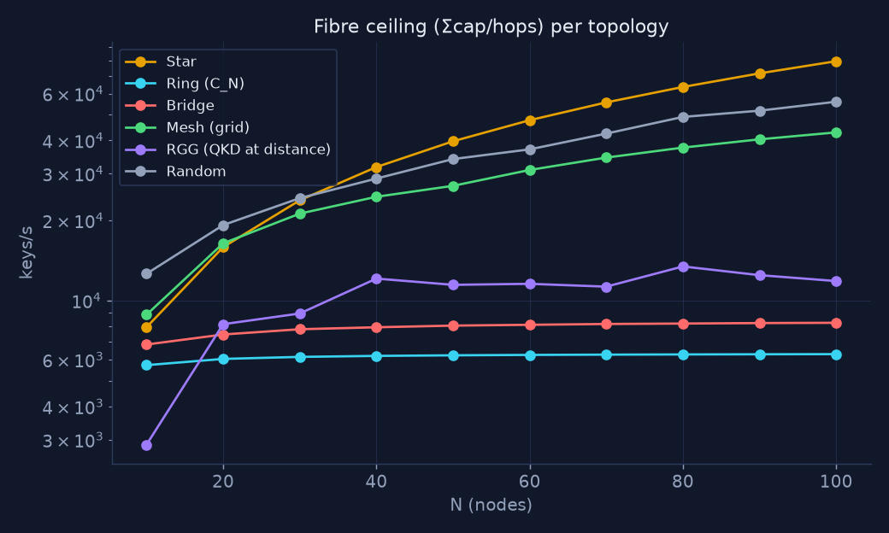

Σcap/ħ against N, log scale: star and random grow linearly, ring and bridge
flatten below 10⁴ keys/s, mesh and RGG sit between.

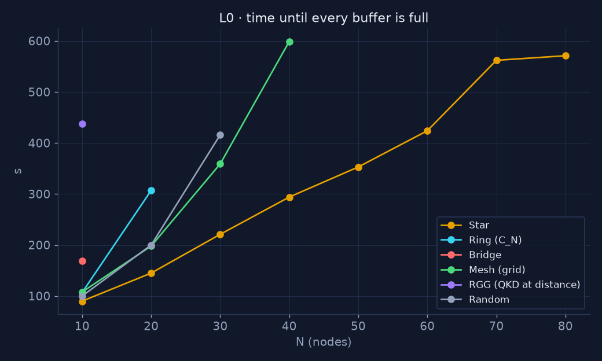

Only the star fills inside 600 s at every size up to N = 80; the other
families drop out of the plot at the N where the window closes first.

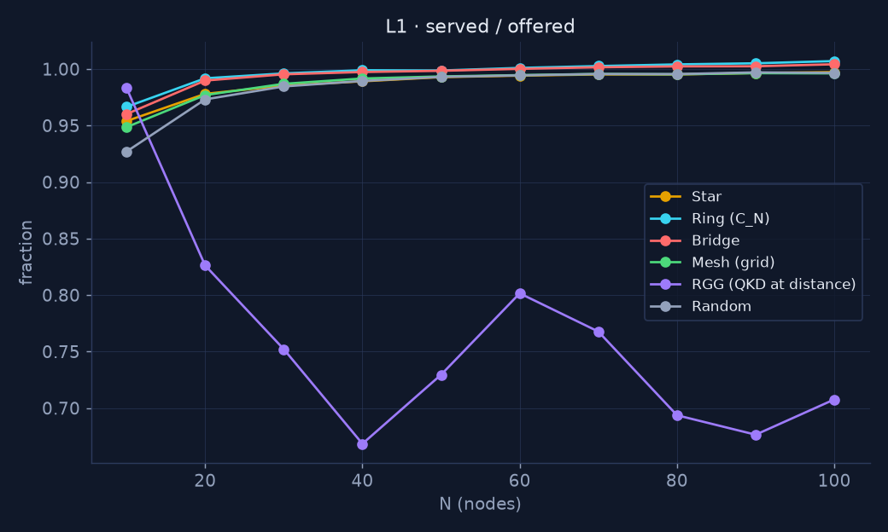

Five families hold 0.93–1.01 at every N; the RGG falls to 0.67–0.83 because
its bottleneck edges throttle the pairs that cross them.

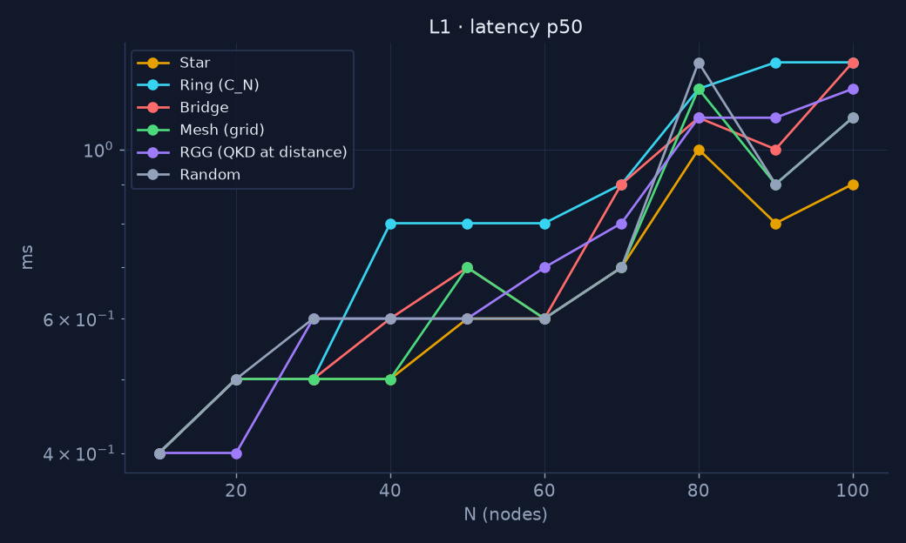

Under the paced load the median request latency stays between 0.4 and
1.3 ms at every size: the request finds its key in the buffer and leaves.

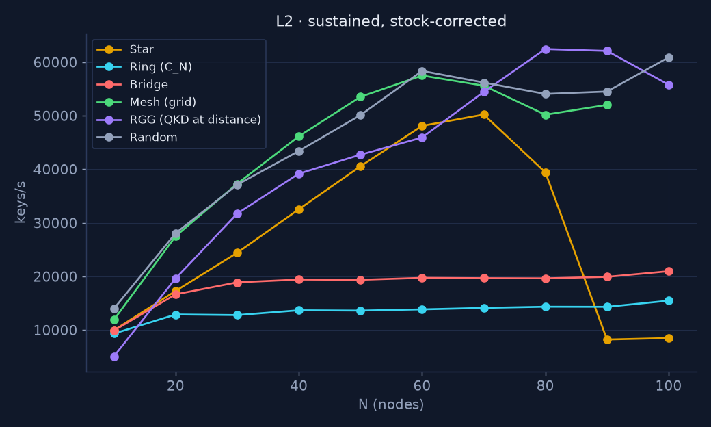

The sustained rate rises with N in the dense families until the node
ceiling, stays flat in ring and bridge, and collapses in the star from
N = 80 when the hub's intake queue overflows.

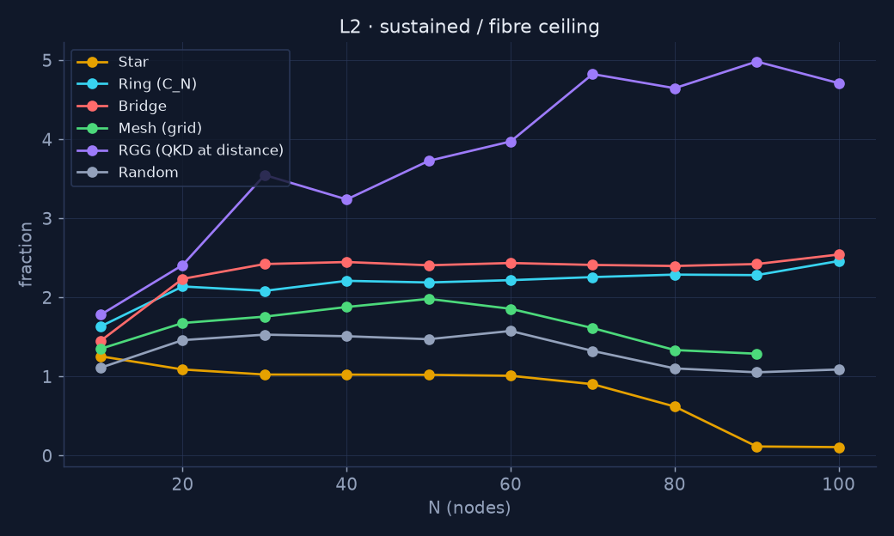

Every family except the star at N ≥ 70 sustains more than the
uniform-demand ceiling; the RGG reaches ×5 because its short pairs take
almost everything.

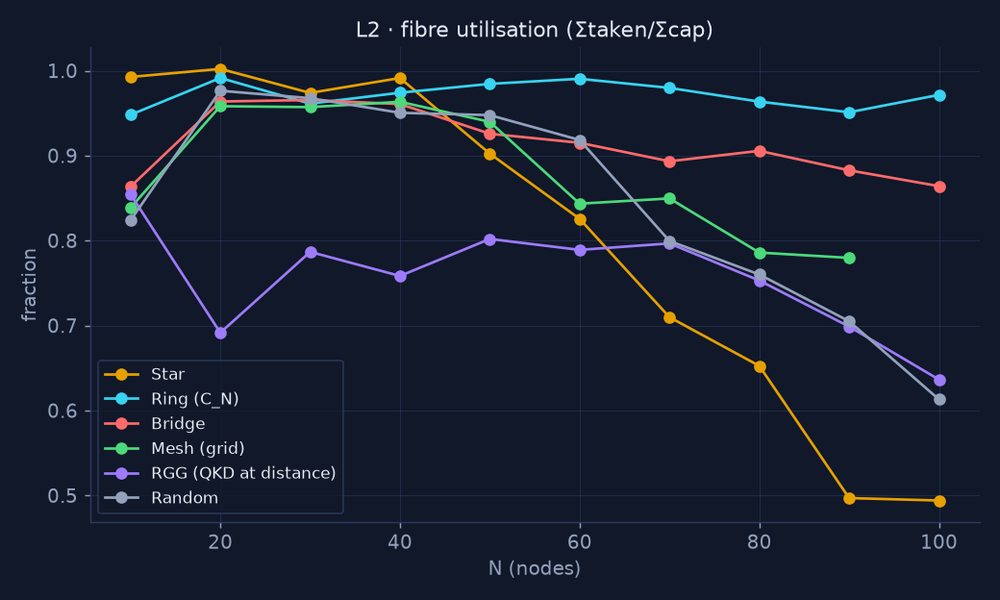

Σtaken/Σcap: the ring stays at 0.95–0.99 at every N; the star falls to 0.49
at N ≥ 90 (hub), mesh and random to 0.61–0.79 at N ≥ 80 (node ceiling).

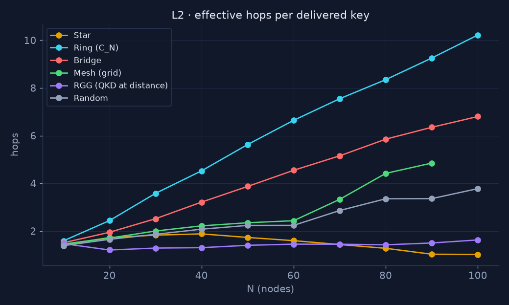

QKD keys spent per delivered transport key: the ring pays 10.2 at N = 100
against a mean distance of 25.3, the RGG 1.6 against 12.2.

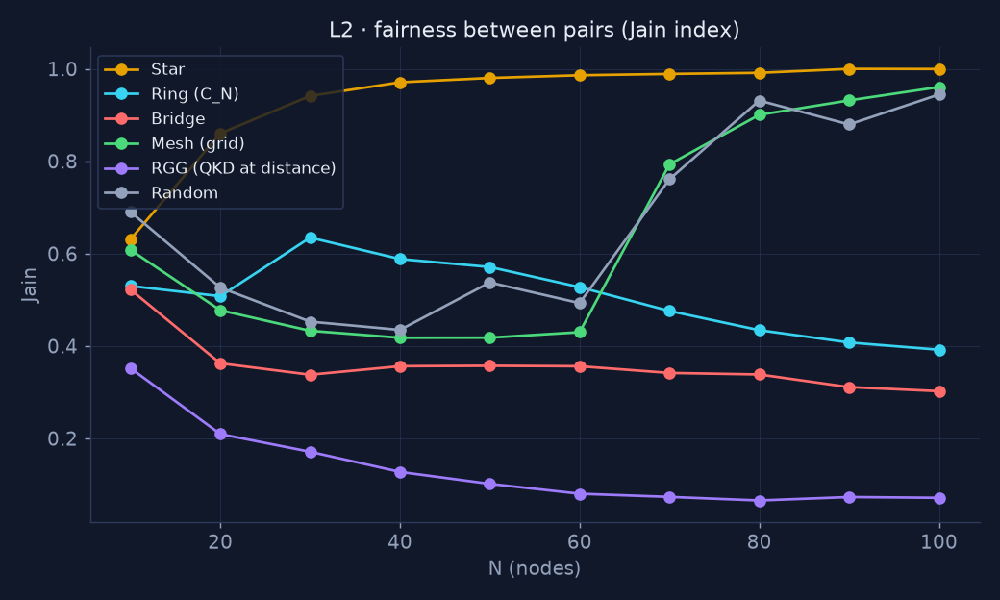

Fairness between pairs: star towards 1.0, ring and bridge downwards to
0.39 and 0.30, RGG to 0.07; the jump of mesh and random at N ≥ 70 is the
machine throttling every flow alike.

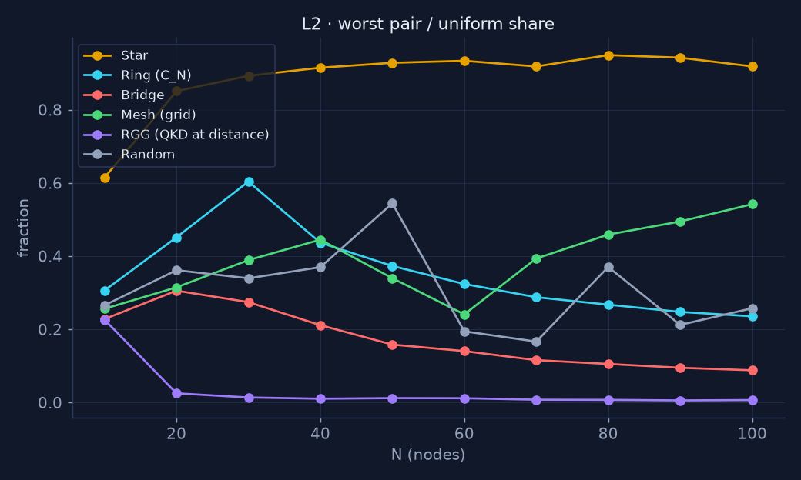

The worst-served pair as a fraction of an equal split: 0.61 at N = 10
rising to 0.92–0.95 in the star, sliding to 0.09 in the bridge, and 0.01
in the RGG from N = 30.

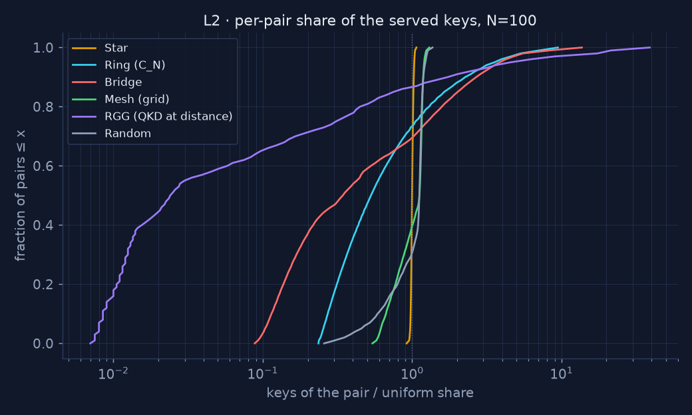

Fraction of ordered pairs served at most x times an equal split, log x:
the star is a vertical line at 1.0, the RGG runs from 0.007 to ×40 with
more than half of its pairs below 0.03.

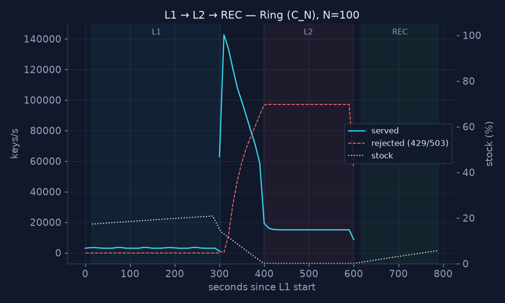

Served and rejected requests per second and stock through L1, L2 and REC:
a flat paced load, a burst that drains the stock in about two minutes, a
plateau at the fibre's pace with the rejection rate rising to match, and a
linear refill.

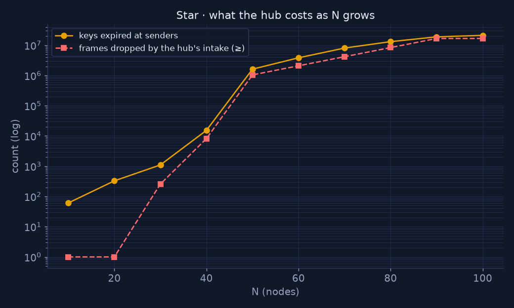

Frames dropped by the hub's intake queue (lower bound) and keys expired at
the senders, log scale: both climb from N = 30 to 2·10⁷ at N = 100.

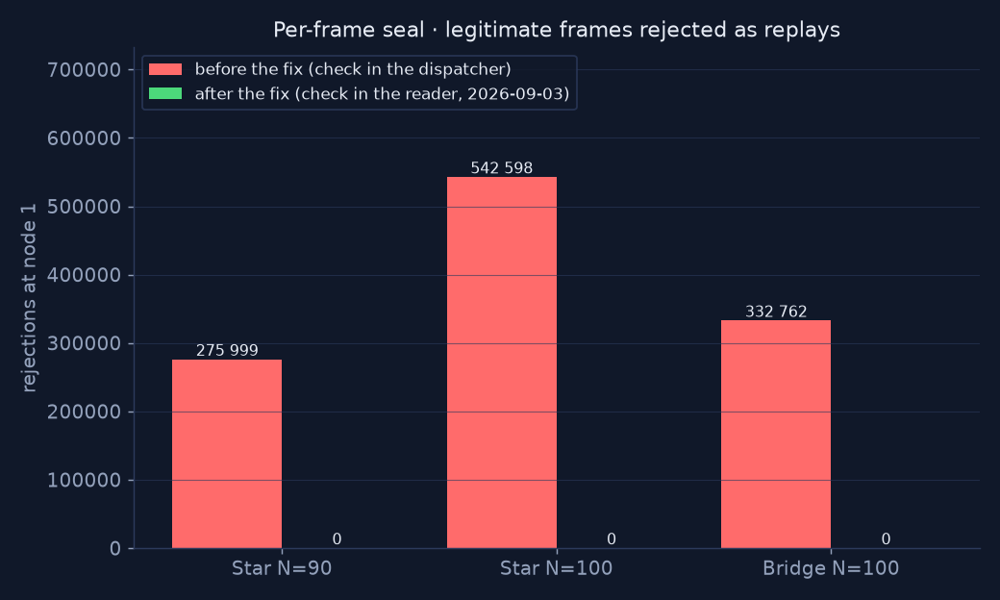

Link MAC rejections at node 1 in the three affected cells: 275 999,
542 598 and 332 762 with the check in the dispatcher, 0 with the check in
the connection reader.
